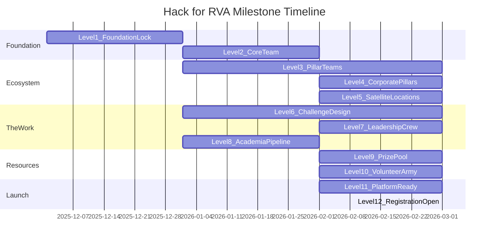

# Communication Plan: Milestone Framework

## Overview

This document defines the **milestone levels** for Hack for RVA's development—a phased approach to building the event's foundation, team, and partnerships. Each level represents a significant achievement that unlocks the next phase and warrants public communication.

The framework ensures we:
- Build in the right order (foundation before team, team before pillars)
- Announce achievements at meaningful moments (not too early, not too late)
- Track progress transparently across the organizing team
- Create momentum through visible milestones

---

## The Story: From Vision to Impact

Building Richmond's first civic hackathon is a journey through five acts:

1. **Act I: Foundation** — Lock the essentials (Levels 1-2)
2. **Act II: Ecosystem** — Build the cross-sector partnerships (Levels 3-5)
3. **Act III: The Work** — Create substance and staff the machine (Levels 6-8)
4. **Act IV: Resources** — Secure what we need to deliver (Levels 9-10)
5. **Act V: Launch** — Open the doors (Levels 11-12)
6. **Epilogue** — Ensure solutions live on (Level 13)

---

## Milestone Summary

| Level | Phase | Name | Description | Target | Status |
|-------|-------|------|-------------|--------|--------|
| **1** | Foundation | Foundation Lock | Date, venue, fiscal sponsor, title sponsor, kickoff meeting | 5 components | 🟡 2 of 5 |
| **2** | Foundation | Core Team | 7 leadership areas defined and staffed | 7 roles | 🟡 6 of 7 |
| **3** | Ecosystem | Pillar Teams | 21 stakeholders across 7 pillars (3 each) | 21 people | ⬜ 0 of 21 |
| **4** | Ecosystem | Corporate Pillars | Corporate sponsor rep added to each pillar | 7 people | ⬜ 0 of 7 |
| **5** | Ecosystem | Satellite Locations | Distributed hack spaces including 2 all-night venues | ~15 locations | ⬜ 0 of ~15 |
| **6** | The Work | Challenge Design | 7 crisp problem statements with research + raw data | 7 challenges | ⬜ 0 of 7 |
| **7** | The Work | Leadership Crew | 23 sub-roles beyond core leadership (t-shirt tier) | 23 roles | ⬜ 0 of 23 |
| **8** | The Work | Academia Pipeline | K-12 districts + specialty schools + universities confirmed | 10+ partners | ⬜ 0 of 10 |
| **9** | Resources | Prize Pool Secured | $17K+ in awards funded and committed | $17K+ | ⬜ $0 |
| **10** | Resources | Volunteer Army | 150-200 volunteers recruited + trained | 150-200 | ⬜ 0 |
| **11** | Launch | Platform Ready | Devpost + Discord + GitHub configured, tested | 3 platforms | ⬜ 0 of 3 |
| **12** | Launch | Registration Open | 300+ participants / 30+ teams registered | 300+ / 30+ | ⬜ 0 |
| **13** | Epilogue | Implementation Handoff | Top winners have 90-day plans + city department matches | 3+ solutions | ⬜ 0 |

---

## Parallel Workstreams

Not all levels are sequential. Some run in parallel:



**Key Parallel Tracks:**
- **Level 6 (Challenge Design)** starts with Level 3, not after Level 5
- **Level 8 (Academia Pipeline)** has hard deadlines (field trips need 4-6 weeks) — must start early
- **Levels 9-11** can all run in parallel during the final weeks

---

# ACT I: FOUNDATION

## Level 1: Foundation Lock

**Purpose:** Establish the foundational infrastructure and partnerships that legitimize the event and enable all subsequent work.

### Components

| Component | Description | Target | Status | Notes |
|-----------|-------------|--------|--------|-------|
| **Event Date** | Weekend dates locked | March 27-29, 2026 | ✅ Confirmed | Friday evening → Sunday evening |
| **Venue Partner** | Primary hackathon location secured | Science Museum of Virginia (Gottwald Center) | ✅ Confirmed | Crystal Harvey as venue liaison |
| **Fiscal Sponsor** | Nonprofit to handle finances, grants, liability | AI Ready RVA | ⬜ In Discussions | Enables tax-deductible donations |
| **Title Sponsor** | Anchor corporate partner ($50K+ commitment) | CoStar | ⬜ In Discussions | Will Melton leading outreach |
| **Founding Partners Kickoff** | Alignment meeting with all parties | See attendees below | ⬜ Not Scheduled | Required to complete Level 1 |

### Kickoff Meeting

**Purpose:** Align all founding partners on vision, roles, timeline, and public launch strategy.

**Required Attendees:**

| Party | Representatives |
|-------|-----------------|
| **Core Team** | Ford Prior, Crystal Harvey, Michael Kolbe, Sinclair Jenks, Heather Lyne, Will Melton |
| **Fiscal Sponsor** | AI Ready RVA leadership |
| **Title Sponsor** | CoStar representatives |
| **City of Richmond** | Mayor's office / designated city liaison |
| **Venue Partner** | Science Museum of Virginia event team |

**Agenda Items:**
1. Vision and goals alignment
2. Role clarification for each party
3. Timeline and key dates
4. Communication and branding coordination
5. Public announcement strategy
6. Next steps and action items

### Completion Criteria

✅ All 5 components confirmed  
✅ Kickoff meeting held with all parties  
✅ Roles and responsibilities documented  

**Level 1 = COMPLETE** when all criteria met.

### Announcement Template

> **Hack for RVA is official.**
>
> With AI Ready RVA as our fiscal sponsor, CoStar as our title sponsor, the Science Museum of Virginia as our home, and the full backing of the City of Richmond—Richmond's first civic hackathon is locked for March 27-29, 2026.
>
> This isn't just a tech event. It's a new model for how Richmond solves problems: government, business, nonprofits, and technologists working together on the Mayor's Action Plan pillars.
>
> More details coming soon. Registration opens [date].

---

## Level 2: Core Team

**Purpose:** Define and staff the leadership roles that will build and run the hackathon.

### Core Leadership Roles

| Role | Focus Area | Owner | Status |
|------|------------|-------|--------|
| **Event Director** | Overall vision, mayor's office liaison | Ford Prior | ✅ Confirmed |
| **Venue & Operations** | Science Museum coordination, logistics, catering, AV | Crystal Harvey | ✅ Confirmed |
| **City Liaison** | Government stakeholders, pillars, SMEs | Michael Kolbe | ✅ Confirmed |
| **Marketing & Comms** | Brand, social media, press, content | Sinclair Jenks | ✅ Confirmed |
| **Entrepreneurial Ecosystems** | Mentorship, pitch coaching, design support | Heather Lyne | ✅ Confirmed |
| **Sponsorships & Partnerships** | Corporate sponsors, nonprofit partners | Will Melton | ✅ Confirmed |
| **Community & Volunteers** | Volunteer recruitment, participant experience | TBD | ⬜ Open |

### What Each Role Owns

**Event Director (Ford Prior)**
- Overall event vision and strategy
- Mayor's office relationship
- Platform and technology decisions
- Judging framework

**Venue & Operations (Crystal Harvey)**
- Science Museum relationship and logistics
- Catering and food service
- AV and technical setup
- Day-of operations coordination

**City Liaison (Michael Kolbe)**
- City department engagement
- Pillar challenge design
- Subject matter expert recruitment
- Government data access

**Marketing & Comms (Sinclair Jenks)**
- Brand identity and visual design
- Website and social media
- Press and media relations
- Participant communications

**Entrepreneurial Ecosystems (Heather Lyne)**
- Design Lounge (VCU Brandcenter)
- Pitch coaching and business mentorship
- Startup and innovation community engagement
- Workshop facilitation

**Sponsorships & Partnerships (Will Melton)**
- Corporate sponsor recruitment
- Sponsorship package development
- Partner relationship management
- Sponsorship fulfillment

**Community & Volunteers (TBD)**
- Volunteer recruitment and coordination
- Participant experience design
- Team formation facilitation
- Community outreach

### Completion Criteria

✅ All 7 roles defined with clear responsibilities  
✅ All 7 roles staffed with confirmed owners  
✅ Each owner has begun building their sub-team  

**Level 2 = COMPLETE** when all criteria met.

### Announcement Template

> **Meet the team making Hack for RVA happen.**
>
> Seven leaders. Seven focus areas. One mission: bring Richmond together to solve our biggest challenges.
>
> [Team photo or individual photos]
>
> - Ford Prior — Event Director
> - Crystal Harvey — Venue & Operations  
> - Michael Kolbe — City Liaison
> - Sinclair Jenks — Marketing & Communications
> - Heather Lyne — Entrepreneurial Ecosystems
> - Will Melton — Sponsorships & Partnerships
> - [Name] — Community & Volunteers
>
> Together, we're building Richmond's first civic hackathon—not as a one-time event, but as a new model for how our city innovates.

---

# ACT II: ECOSYSTEM

## Level 3: Pillar Teams

**Purpose:** Staff all 7 Mayor's Action Plan pillars with high-quality stakeholder teams who will shape challenges, support hackers, and judge solutions.

### The Model: 3 Roles Per Pillar = 21 People

| Role | Responsibility | Commitment |
|------|---------------|------------|
| **Nonprofit Partner Rep** | On-the-ground expertise, community voice, pillar judge | Friday kickoff (15-20 min), Sunday judging (3-4 hrs), Discord availability |
| **City Hall Owner** | Government champion, implementation pathway, city data | Friday kickoff (15-20 min), optional weekend availability |
| **Breakout Coordinator** | Runs Friday session, facilitates weekend support, team liaison | Friday session lead, Saturday check-ins, Sunday support |

### Pillar Tracking

| # | Pillar | Nonprofit Partner Rep | City Hall Owner | Breakout Coordinator | Status |
|---|--------|----------------------|-----------------|---------------------|--------|
| 1 | Thriving City Hall | TBD | TBD | TBD | ⬜ 0/3 |
| 2 | Thriving Neighborhoods | TBD | TBD | TBD | ⬜ 0/3 |
| 3 | Thriving Families | TBD | TBD | TBD | ⬜ 0/3 |
| 4 | Thriving Economy | TBD | TBD | TBD | ⬜ 0/3 |
| 5 | Inclusive Communities | TBD | TBD | TBD | ⬜ 0/3 |
| 6 | Thriving Environment | TBD | TBD | TBD | ⬜ 0/3 |
| 7 | City Stories | TBD | TBD | TBD | ⬜ 0/3 |

**Total: 0 of 21 confirmed**

### Role Details

#### Nonprofit Partner Rep

**Who:** Executive Director or senior leader from an organization working in the pillar domain.

**Why they matter:** They know what's actually happening on the ground. They can tell hackers "we've tried that and it didn't work" or "that would be amazing because..." Their judgment ensures winning solutions address real needs.

**Ideal partners by pillar:**

| Pillar | Potential Nonprofit Partners |
|--------|------------------------------|
| 1. Thriving City Hall | Code for America brigade, civic tech groups |
| 2. Thriving Neighborhoods | RVA Eviction Lab, HOME, Better Housing Coalition |
| 3. Thriving Families | RPS Foundation, YMCA, Boys & Girls Club |
| 4. Thriving Economy | Venture Richmond, Black Business Alliance, SWaM orgs |
| 5. Inclusive Communities | Health Brigade, Side by Side, Equality Virginia |
| 6. Thriving Environment | Groundwork RVA, James River Association, Enrichmond |
| 7. City Stories | Maggie Walker NHS, Black History Museum, Elegba Folklore |

#### City Hall Owner

**Who:** City staff from relevant department with authority to speak to implementation.

**Why they matter:** They know what's actually possible within city constraints. They can champion winning solutions internally. They have access to data and systems.

**Note:** One city person may cover 2-3 related pillars due to headcount constraints.

#### Breakout Coordinator

**Who:** Organizer or experienced facilitator who can run a session and support teams.

**Why they matter:** They're the glue that makes the pillar experience cohesive. They ensure the Friday session runs well, check in with teams during hacking, and help connect hackers to the right resources.

### Completion Criteria

✅ All 7 pillars have confirmed Nonprofit Partner Rep  
✅ All 7 pillars have confirmed City Hall Owner  
✅ All 7 pillars have confirmed Breakout Coordinator  
✅ All 21 stakeholders have committed to their responsibilities  

**Level 3 = COMPLETE** when all criteria met.

### Announcement Template

> **7 Pillars. 21 Leaders. Richmond's challenges meet Richmond's talent.**
>
> We've assembled the teams who will shape Hack for RVA's challenges. For each of Mayor Avula's 7 Action Plan pillars, we have:
>
> - A **nonprofit partner** bringing on-the-ground expertise
> - A **city leader** connecting solutions to government action
> - A **facilitator** guiding hackers through the weekend
>
> These aren't just advisors—they're judges, mentors, and potential adopters of winning solutions.
>
> [Grid or list of all 21 stakeholders by pillar]
>
> The pillars are set. The challenges are real. Now we need you.
> Registration opens [date].

---

## Level 4: Corporate Pillars

**Purpose:** Add corporate sponsor representation to each pillar, completing the cross-sector partnership model.

### The Model: 4 Roles Per Pillar = 28 People

Building on Level 3, each pillar adds:

| Role | Responsibility | Commitment |
|------|---------------|------------|
| **Corporate Sponsor Rep** | Business perspective, funding ($1K+ pillar award), industry expertise | Friday kickoff (5-10 min), optional mentoring/judging |

### Full Pillar Team Structure (Level 4)

| # | Pillar | Nonprofit Rep | City Hall Owner | Breakout Coordinator | Corporate Rep | Status |
|---|--------|--------------|-----------------|---------------------|---------------|--------|
| 1 | Thriving City Hall | TBD | TBD | TBD | TBD | ⬜ 0/4 |
| 2 | Thriving Neighborhoods | TBD | TBD | TBD | TBD | ⬜ 0/4 |
| 3 | Thriving Families | TBD | TBD | TBD | TBD | ⬜ 0/4 |
| 4 | Thriving Economy | TBD | TBD | TBD | TBD | ⬜ 0/4 |
| 5 | Inclusive Communities | TBD | TBD | TBD | TBD | ⬜ 0/4 |
| 6 | Thriving Environment | TBD | TBD | TBD | TBD | ⬜ 0/4 |
| 7 | City Stories | TBD | TBD | TBD | TBD | ⬜ 0/4 |

**Total: 0 of 28 confirmed** (Level 3 must complete first)

### Corporate Sponsor Rep Details

**Who:** Representative from a company with interest in the pillar domain.

**Minimum commitment:** $1,000 for pillar award funding + Friday kickoff presence.

**Why they matter:** They bring business perspective, resources, and potential implementation pathways through private sector. They also validate that solutions could work in the real world.

**Ideal corporate partners by pillar:**

| Pillar | Potential Corporate Sponsors |
|--------|------------------------------|
| 1. Thriving City Hall | Tech companies (CoStar, Capital One, CarMax) |
| 2. Thriving Neighborhoods | Real estate, banking, construction |
| 3. Thriving Families | Education tech, childcare companies |
| 4. Thriving Economy | Staffing agencies, business services, banks |
| 5. Inclusive Communities | Healthcare systems, insurance |
| 6. Thriving Environment | Energy companies (Dominion), environmental services |
| 7. City Stories | Media companies, tourism, cultural institutions |

### The Magic Moment

When Level 4 is complete, each pillar's Friday kickoff becomes a powerful cross-sector convening:

1. **City Hall Owner presents:** "Here's what government sees"
2. **Nonprofit Rep presents:** "Here's what's happening on the ground"
3. **Corporate Rep presents:** "Here's why business cares"
4. **Breakout Coordinator facilitates:** Team formation and Q&A

This brings City + NGO + Business leaders together at the same table, discussing the same civic challenge. That cross-sector dialogue is as valuable as the hackathon itself.

### Completion Criteria

✅ Level 3 complete (all 21 stakeholders confirmed)  
✅ All 7 pillars have confirmed Corporate Sponsor Rep  
✅ All 7 corporate sponsors have committed funding ($1K+ per pillar)  

**Level 4 = COMPLETE** when all criteria met.

### Announcement Template

> **Richmond's civic-private partnership is complete.**
>
> Every pillar of Mayor Avula's Action Plan now has a full team: nonprofit expertise, city leadership, event facilitation, and corporate backing.
>
> **28 leaders across 7 pillars:**
> 
> [Grid showing all 4 roles for each pillar]
>
> This is what happens when a city decides to solve problems together. Government, business, and community—not competing, but collaborating.
>
> Hack for RVA. March 27-29, 2026.

---

## Level 5: Satellite Locations

**Purpose:** Secure distributed hacking venues across Richmond to expand capacity and bring the hackathon into the community—including two all-night locations for teams who want to hack through the night.

### The Model: ~15 Satellite Locations

| Type | Count | Purpose |
|------|-------|---------|
| **All-Night Hack Spaces** | 2 | 24-hour access for overnight hacking (UR + VCU) |
| **Daytime Satellites** | ~13 | Overflow and community access during event hours |

**Note:** Some locations (like Common House) may accommodate multiple teams.

### Location Tracking

#### All-Night Hack Spaces (Required)

| Location | Institution | Status | Site Contact | Site Captain | Notes |
|----------|-------------|--------|--------------|--------------|-------|
| **University of Richmond** | UR | ⬜ Not Started | TBD | TBD | 24-hour access Friday night → Sunday |
| **VCU** | VCU | ⬜ Not Started | TBD | TBD | daVinci Center or Engineering Building |

**Total All-Night: 0 of 2 confirmed**

#### Daytime Satellite Locations (~13 needed)

| # | Location | Type | Status | Site Contact | Site Captain |
|---|----------|------|--------|--------------|--------------|
| 1 | Common House - Downtown | Coworking | ⬜ | TBD | TBD |
| 2 | Common House - Scott's Addition | Coworking | ⬜ | TBD | TBD |
| 3 | Startup Virginia / 1717 Innovation | Coworking | ⬜ | TBD | TBD |
| 4 | Capital One Café - Downtown | Corporate | ⬜ | TBD | TBD |
| 5 | Capital One Café - Short Pump | Corporate | ⬜ | TBD | TBD |
| 6 | Richmond Public Library - Main | Library | ⬜ | TBD | TBD |
| 7 | Richmond Public Library - Broad Rock | Library | ⬜ | TBD | TBD |
| 8 | VCU Library (daytime only) | University | ⬜ | TBD | TBD |
| 9 | UR Library (daytime only) | University | ⬜ | TBD | TBD |
| 10 | CoStar Research Center | Corporate | ⬜ | TBD | TBD |
| 11 | Gather - Scott's Addition | Coworking | ⬜ | TBD | TBD |
| 12 | Circuit - Church Hill | Coworking | ⬜ | TBD | TBD |
| 13 | TBD - Southside location | Community | ⬜ | TBD | TBD |

**Total Daytime: 0 of ~13 confirmed**

### Potential Additional Venues

| Venue | Type | Capacity | 24-Hour? | Notes |
|-------|------|----------|----------|-------|
| **Dominion Energy HQ** | Corporate | 20-30 | ❌ No | Potential sponsor venue |
| **CarMax HQ** | Corporate | 20-30 | ❌ No | Tech-forward, sponsor potential |
| **Ippon Technologies** | Corporate | 15-25 | ❌ No | AI Ready RVA connection |
| **Capital One - West Creek** | Corporate | 30-50 | ❌ No | Larger capacity |
| **Petersburg Library** | Library | 20-30 | ❌ No | Extend beyond Richmond |
| **Henrico Library - Libbie Mill** | Library | 25-35 | ❌ No | County access |

### Requirements Per Satellite

**Minimum Requirements (All Locations):**
- [ ] WiFi capacity for 20+ simultaneous users
- [ ] Adequate power outlets / power strips
- [ ] Accessible seating and work surfaces
- [ ] Restroom access
- [ ] Clear emergency procedures

**All-Night Location Additional Requirements:**
- [ ] 24-hour building access Friday evening → Sunday evening
- [ ] Security/safety protocols for overnight
- [ ] Quiet zones for rest
- [ ] Food storage/refrigeration
- [ ] Proximity to food options or delivery access

### Site Captain Model

Each satellite location needs a **Site Captain** — a volunteer lead who:
- Serves as primary point of contact for that location
- Coordinates with main venue via Discord
- Manages local logistics (A/V, supplies, food)
- Handles issues and escalates to core team as needed
- Ensures participants feel connected to the broader event

**Per-site staffing:** 3-5 volunteers per site (Site Captain + Tech Support + Comfort Monitor)

**Total Saturday volunteers for satellites:** 45-75 people

Site Captains are tracked in the location table above.

### Coordination with Main Venue

Satellite locations connect to the Science Museum (main venue) via:

1. **Discord/Slack channels** — Real-time communication with each satellite
2. **Livestream** — Friday kickoff and Sunday awards streamed to all locations
3. **Roving support** — Mentors rotate between locations or offer virtual office hours
4. **Unified submissions** — All teams submit via same Devpost regardless of location

### Completion Criteria

✅ 2 all-night locations confirmed (UR + VCU)  
✅ ~13 daytime satellite locations confirmed  
✅ All locations meet minimum technical requirements  
✅ Site Captain assigned for each location  
✅ 45-75 Saturday volunteers recruited for satellite staffing  
✅ Communication protocols established with main venue  

**Level 5 = COMPLETE** when all criteria met.

### Announcement Template

> **Hack for RVA is everywhere.**
>
> One hackathon. 15+ locations across Richmond.
>
> Our main venue at the Science Museum of Virginia is joined by satellite hack spaces across the region:
> - **All-Night Venues:** University of Richmond & VCU (hack 'til dawn)
> - **Coworking:** Common House, Startup Virginia, Gather, Circuit
> - **Corporate:** Capital One, CoStar, and more
> - **Libraries:** Richmond Public Library branches
>
> Whether you're a night owl who wants to code until dawn, prefer a coffee shop vibe, or want to work from your neighborhood—there's a space for you.
>
> Same challenges. Same community. Same mission. Just closer to you.

---

# ACT III: THE WORK

## Level 6: Challenge Design

**Purpose:** Create 7 crisp, solvable problem statements with research, raw data, and grading rubrics—ensuring hackers build solutions that can actually be implemented.

**Timeline Note:** This work starts in PARALLEL with Level 3 and must complete before the event. City Liaisons and Nonprofit Partners inform the challenge design process.

### The Model: What Each Pillar Delivers

| Component | Description | Owner |
|-----------|-------------|-------|
| **Problem Statement** | 1-paragraph crisp description of the civic challenge | City Liaison + Nonprofit Partner |
| **Research Brief** | Context on existing initiatives, what's been tried, what works | Pre-Event Prep Team |
| **Raw Data Package** | Curated datasets from Richmond Open Data Portal, city systems | Data Ambassador + City Data Liaison |
| **Grading Rubric** | What "good," "better," and "best" solutions look like | Judging Team + Pillar Stakeholders |
| **Implementation Pathway** | How winning solutions could be adopted by city/nonprofits | City Hall Owner |

### Challenge Tracking

| # | Pillar | Problem Statement | Research Brief | Data Package | Rubric | Status |
|---|--------|------------------|----------------|--------------|--------|--------|
| 1 | Thriving City Hall | ⬜ | ⬜ | ⬜ | ⬜ | ⬜ 0/4 |
| 2 | Thriving Neighborhoods | ⬜ | ⬜ | ⬜ | ⬜ | ⬜ 0/4 |
| 3 | Thriving Families | ⬜ | ⬜ | ⬜ | ⬜ | ⬜ 0/4 |
| 4 | Thriving Economy | ⬜ | ⬜ | ⬜ | ⬜ | ⬜ 0/4 |
| 5 | Inclusive Communities | ⬜ | ⬜ | ⬜ | ⬜ | ⬜ 0/4 |
| 6 | Thriving Environment | ⬜ | ⬜ | ⬜ | ⬜ | ⬜ 0/4 |
| 7 | City Stories | ⬜ | ⬜ | ⬜ | ⬜ | ⬜ 0/4 |

**Total: 0 of 28 components complete**

### Data Sources

Priority data to curate for participants:

| Source | Examples | Owner |
|--------|----------|-------|
| **Richmond Open Data Portal** | 311 data, permits, crime stats | Data Ambassador |
| **RVAgreen 2050** | Climate action plan data | Pre-Event Prep Team |
| **City GIS** | Parcel data, zoning, infrastructure | City Data Liaison |
| **Census/ACS** | Demographics, housing, economics | Data Ambassador |
| **Pillar-Specific** | Eviction data (Neighborhoods), health data (Inclusive) | Pillar stakeholders |

### Completion Criteria

✅ All 7 pillars have approved problem statements  
✅ All 7 pillars have research briefs available  
✅ All 7 pillars have curated data packages  
✅ Grading rubrics published to participants 2 weeks before event  
✅ Challenge materials reviewed by city stakeholders  

**Level 6 = COMPLETE** when all criteria met.

### Announcement Template

> **The challenges are set. The data is ready.**
>
> We've worked with city leaders, nonprofit partners, and community experts to define 7 real problems facing Richmond—problems you can help solve.
>
> Each challenge comes with:
> - A crisp problem statement
> - Research on what's been tried
> - Real city data to work with
> - Clear criteria for what makes a winning solution
>
> [Challenge previews by pillar]
>
> These aren't hypotheticals. These are the priorities from Mayor Avula's Action Plan. Build something that matters.

---

## Level 7: Leadership Crew

**Purpose:** Staff the 23 leadership sub-roles beyond the 7 core leaders—the "t-shirt tier" who get the special organizer shirts and own specific functional areas.

### The 23 Leadership Sub-Roles

These roles are drawn from the [Organizing Team Structure](../02-team-governance/organizing-team-structure.md) and [Leadership-Volunteer Mapping](../02-team-governance/leadership-volunteer-mapping.md).

#### Core Leadership (Level 2 — Already Tracked)

| # | Role | Owner | Status |
|---|------|-------|--------|
| 1 | Event Director | Ford Prior | ✅ |
| 2 | Venue & Operations | Crystal Harvey | ✅ |
| 3 | City Liaison | Michael Kolbe | ✅ |
| 4 | Marketing & Comms | Sinclair Jenks | ✅ |
| 5 | Entrepreneurial Ecosystems | Heather Lyne | ✅ |
| 6 | Sponsorships & Partnerships | Will Melton | ✅ |
| 7 | Community & Volunteers | TBD | ⬜ |

#### Venue & Logistics Cluster

| # | Role | Responsibility | Owner | Status |
|---|------|---------------|-------|--------|
| 8 | Science Museum Liaison | Main venue coordination, AV, catering | TBD | ⬜ |
| 9 | Satellite Location Coordinator | 15+ venue relationships | TBD | ⬜ |
| 10 | 24/7 Access Coordinator | All-night venue oversight | TBD | ⬜ |

#### Programming & Content Cluster

| # | Role | Responsibility | Owner | Status |
|---|------|---------------|-------|--------|
| 11 | Friday Programming Lead | Kickoff ceremonies, pillar sessions | TBD | ⬜ |
| 12 | SME Recruiter | Subject matter expert engagement | TBD | ⬜ |
| 13 | Data Ambassador Coordinator | Cross-pillar data support | TBD | ⬜ |

#### Support Infrastructure Cluster

| # | Role | Responsibility | Owner | Status |
|---|------|---------------|-------|--------|
| 14 | Design Lounge Lead | VCU Brandcenter mentors (6-8) | TBD | ⬜ |
| 15 | Hacker Space Lead | Technical mentors (8-12) | TBD | ⬜ |
| 16 | Business Room Lead | Pitch coaches (4-6) | TBD | ⬜ |
| 17 | Mentor Coordinator | Help desk, mentor queue | TBD | ⬜ |

#### Technology & Data Cluster

| # | Role | Responsibility | Owner | Status |
|---|------|---------------|-------|--------|
| 18 | Technology Support Coordinator | Cloud credits, dev resources | TBD | ⬜ |
| 19 | City Data Liaison | Government data access, APIs | TBD | ⬜ |
| 20 | Platform Administrator | Devpost, Discord, GitHub | TBD | ⬜ |

#### Community & Communications Cluster

| # | Role | Responsibility | Owner | Status |
|---|------|---------------|-------|--------|
| 21 | Volunteer Coordinator | 150-200 volunteer recruitment | TBD | ⬜ |
| 22 | Social Media Manager | Photographers, content creators | TBD | ⬜ |
| 23 | Registration Manager | Check-in, badges, info desk | TBD | ⬜ |

#### Judging & Awards Cluster

| # | Role | Responsibility | Owner | Status |
|---|------|---------------|-------|--------|
| 24 | Judge Coordinator | Judge recruitment, deliberation | TBD | ⬜ |

#### Post-Event Cluster

| # | Role | Responsibility | Owner | Status |
|---|------|---------------|-------|--------|
| 25 | Post-Event Sustainability Coordinator | Implementation handoff | TBD | ⬜ |
| 26 | Nonprofit Partnership Coordinator | 7 nonprofit relationships | TBD | ⬜ |

#### Cross-Cutting

| # | Role | Responsibility | Owner | Status |
|---|------|---------------|-------|--------|
| 27 | Data Ambassador | All-pillar data expert | TBD | ⬜ |

**Total Sub-Roles: 0 of 20 staffed** (beyond core 7)

### The T-Shirt Tier

These 27 people (7 core + 20 sub-roles) are the **Leadership Crew**—they get:
- Special organizer t-shirts (different color/design than participants)
- Access to leadership Discord channel
- Pre-event planning meetings
- Post-event celebration invite
- Recognition on website and materials

### Completion Criteria

✅ All 27 leadership roles defined  
✅ All 27 roles staffed with confirmed owners  
✅ Each owner understands their responsibilities  
✅ Leadership t-shirt order placed  

**Level 7 = COMPLETE** when all criteria met.

### Announcement Template

> **Meet the crew behind Hack for RVA.**
>
> 27 leaders. 27 responsibilities. One mission.
>
> Beyond our core team, we've assembled specialists in venues, programming, mentorship, technology, volunteers, and more—each owning a piece of what makes this hackathon work.
>
> [Leadership crew photo or grid]
>
> These are the people who will greet you at registration, connect you to mentors, keep the wifi running, and make sure your solutions get seen.
>
> Hack for RVA. March 27-29, 2026.

---

## Level 8: Academia Pipeline

**Purpose:** Secure participation from K-12 districts, specialty schools, and universities—ensuring diverse, qualified participants and compliance for minors.

**Timeline Note:** This has HARD DEADLINES. Field trips need 4-6 weeks lead time. Bus requests for HCPS/CCPS are due **February 13, 2026**. Start early.

### Partner Categories

| Category | Target | Purpose |
|----------|--------|---------|
| **K-12 Districts** | RPS, Henrico, Chesterfield | CTE program integration, field trip approval |
| **Specialty Schools** | CodeRVA, MLWGS, Governor's Academy | High-compatibility CS/civic students |
| **Universities** | VCU, UR, VSU | Mentors, participants, venue support |

### K-12 District Tracking

| District | CTE Leader | Key Schools | Spring Break | Status | Notes |
|----------|------------|-------------|--------------|--------|-------|
| **RPS** | Dr. Rhonda Turner | RTC, RCHS, Open High | April 1 | ⬜ Not Contacted | March 27 is school day |
| **Henrico** | Mac Beaton | ACE Centers, Deep Run | March 30 | ⬜ Not Contacted | National CTE leader |
| **Chesterfield** | Chad Maclin | Governor's Academy (L.C. Bird) | March 30 | ⬜ Not Contacted | Transportation challenge |

### Specialty School Tracking

| School | Compatibility | March 27 Status | Key Contact | Status |
|--------|--------------|-----------------|-------------|--------|
| **CodeRVA** | HIGH | In Session | TBD | ⬜ |
| **Maggie L. Walker Governor's School** | HIGH | Potential Holiday* | TBD | ⬜ |
| **Governor's Academy for Engineering** | MEDIUM | In Session | Dr. Nancy Hoover | ⬜ |
| **Wilder School (VCU)** | HIGH | In Session | TBD | ⬜ |

*If fewer than 5 snow days used, March 27 becomes a school holiday at MLWGS.

### University Tracking

| University | Role | Key Contacts | Status |
|------------|------|--------------|--------|
| **VCU** | Host Partner | CS Dept, daVinci Center, Service Learning | ⬜ |
| **University of Richmond** | Civic Engagement | Bonner Center (Sylvia Gale), CCE | ⬜ |
| **Virginia State University** | Diversity Partner | Engineering Dean (Dr. Dawit Haile) | ⬜ |

### Critical Deadlines

| Date | Action | Owner | Priority |
|------|--------|-------|----------|
| **Feb 13, 2026** | Submit bus requests to HCPS/CCPS | TBD | CRITICAL |
| **Feb 15, 2026** | Distribute Teacher Toolkits | TBD | High |
| **Feb 25, 2026** | VCU Protection of Minors registration | TBD | CRITICAL |
| **Mar 1, 2026** | Bind special event liability insurance | TBD | High |
| **Mar 15, 2026** | Collect all parent-signed permission slips | TBD | High |
| **Mar 20, 2026** | Finalize chaperone background checks | TBD | High |

### Compliance Requirements for Minors

| Requirement | Details | Status |
|-------------|---------|--------|
| VCU Protection of Minors Registration | Register event 30 days in advance | ⬜ |
| Background Checks (Tier I/II Staff) | Multi-state criminal + sex offender registry | ⬜ |
| 1:10 Adult-to-Minor Ratio | Maintain for all time blocks | ⬜ |
| "Rule of Two" | Never one adult alone with minor | ⬜ |
| Parent Permission Slips | Liability, media, medical release | ⬜ |
| Color-Coded Lanyards | RED = Minors, GREEN = University, BLUE = Staff | ⬜ |
| Insurance | $1M/$2M special event liability | ⬜ |

### Diploma Seal Integration

Frame participation to help students earn:

| Seal | Requirement | Hackathon Fit |
|------|-------------|---------------|
| **Excellence in Civics Education** | 50 hours civic service | 15-20 hours (Fri-Sun) as "Civic Tech" |
| **STEM Seal** | 50 hours WBL in STEM | Counts as service learning/job shadowing |

### Completion Criteria

✅ At least 2 K-12 districts confirmed with field trip approval  
✅ At least 2 specialty schools participating  
✅ VCU and UR confirmed as partners  
✅ All compliance requirements met  
✅ Transportation arranged for students needing it  

**Level 8 = COMPLETE** when all criteria met.

### Announcement Template

> **Richmond's students are part of Hack for RVA.**
>
> We've partnered with Richmond-area schools and universities to bring the next generation of civic innovators to the table:
>
> - **K-12 Partners:** [Districts/Schools]
> - **University Partners:** VCU, University of Richmond, VSU
>
> Students can earn credit toward their Civics and STEM Diploma Seals while building real solutions for Richmond's challenges.
>
> This isn't a field trip. It's a launch pad.

---

# ACT IV: RESOURCES

## Level 9: Prize Pool Secured

**Purpose:** Secure $17K+ in prize funding to reward winning solutions and incentivize participation.

### Prize Structure

| Award | Amount | Judge/Voter | Funding Source |
|-------|--------|-------------|----------------|
| **Mayor's Choice** | $5,000 | Mayor Avula + designees | Title Sponsor |
| **People's Choice** | $2,500 | Audience vote | Title Sponsor |
| **Judges' Choice** | $2,500 | Panel of 3-5 judges | Title Sponsor |
| **Pillar 1: Thriving City Hall** | $1,000 | Pillar stakeholders | Pillar Sponsor |
| **Pillar 2: Thriving Neighborhoods** | $1,000 | Pillar stakeholders | Pillar Sponsor |
| **Pillar 3: Thriving Families** | $1,000 | Pillar stakeholders | Pillar Sponsor |
| **Pillar 4: Thriving Economy** | $1,000 | Pillar stakeholders | Pillar Sponsor |
| **Pillar 5: Inclusive Communities** | $1,000 | Pillar stakeholders | Pillar Sponsor |
| **Pillar 6: Thriving Environment** | $1,000 | Pillar stakeholders | Pillar Sponsor |
| **Pillar 7: City Stories** | $1,000 | Pillar stakeholders | Pillar Sponsor |
| **TOTAL** | **$17,000** | | |

### Funding Breakdown

| Source | Contribution | Awards Covered |
|--------|--------------|----------------|
| **Title Sponsor (CoStar)** | $10,000 | Mayor's, People's, Judges' Choice |
| **7 Pillar Sponsors** | $7,000 ($1K each) | Pillar Awards |
| **TOTAL** | **$17,000** | All 10 awards |

### Funding Tracking

| Source | Committed | Received | Status |
|--------|-----------|----------|--------|
| Title Sponsor (CoStar) | ⬜ $0 | ⬜ $0 | ⬜ Not Confirmed |
| Pillar 1 Sponsor | ⬜ $0 | ⬜ $0 | ⬜ Not Confirmed |
| Pillar 2 Sponsor | ⬜ $0 | ⬜ $0 | ⬜ Not Confirmed |
| Pillar 3 Sponsor | ⬜ $0 | ⬜ $0 | ⬜ Not Confirmed |
| Pillar 4 Sponsor | ⬜ $0 | ⬜ $0 | ⬜ Not Confirmed |
| Pillar 5 Sponsor | ⬜ $0 | ⬜ $0 | ⬜ Not Confirmed |
| Pillar 6 Sponsor | ⬜ $0 | ⬜ $0 | ⬜ Not Confirmed |
| Pillar 7 Sponsor | ⬜ $0 | ⬜ $0 | ⬜ Not Confirmed |
| **TOTAL** | **$0** | **$0** | |

### Judging Panel

| Award | Judges | Recruitment Owner |
|-------|--------|-------------------|
| **Mayor's Choice** | Mayor Avula + 2 designees | Event Director |
| **People's Choice** | Audience vote (no panel) | Platform Administrator |
| **Judges' Choice** | Panel of 3-5 (tech, business, civic) | Judge Coordinator |
| **Pillar Awards** | Nonprofit Partner Rep + City Hall Owner | Pillar stakeholders |

**Judges' Choice Panel Composition:**
- 1-2 tech leaders (CTO/VP Engineering from major Richmond companies)
- 1-2 business leaders (CEO/entrepreneur)
- 1-2 civic leaders (nonprofit ED, community advocate)

### Prize Administration

- **Tax implications:** Prizes over $600 require 1099 reporting
- **Distribution method:** Checks or direct deposit (via fiscal sponsor)
- **Timeline:** Distribute within 2 weeks of event
- **Owner:** Gifts & Swag Team + Fiscal Sponsor

### Completion Criteria

✅ $17K+ committed from sponsors  
✅ All prize funds received by fiscal sponsor  
✅ Judging panels confirmed for all awards  
✅ Prize distribution logistics confirmed  

**Level 9 = COMPLETE** when all criteria met.

### Announcement Template

> **$17,000 in prizes. Real money for real solutions.**
>
> Hack for RVA isn't just about building—it's about winning.
>
> **Top Awards:**
> - Mayor's Choice: $5,000
> - People's Choice: $2,500
> - Judges' Choice: $2,500
>
> **Plus $1,000 for each pillar winner:**
> - Thriving City Hall, Neighborhoods, Families, Economy, Inclusive Communities, Environment, City Stories
>
> Build something that matters. Get rewarded.

---

## Level 10: Volunteer Army

**Purpose:** Recruit and train 150-200 volunteers to staff all event functions across multiple days and locations.

### Volunteer Categories

| Category | Count | Primary Roles |
|----------|-------|---------------|
| **Pre-Event** | 25-35 | Outreach ambassadors, data prep, venue scouts |
| **Friday** | 35-45 | Registration, wayfinders, room captains, AV |
| **Saturday** | 60-80 | Site captains, tech support, comfort monitors, help desk |
| **Sunday** | 30-40 | Setup, judging support, stage, cleanup |
| **Support** | 30-40 | Mentors (tech, design, business), SMEs, accessibility |
| **TOTAL** | **150-200** | ~1,600 volunteer hours |

### Recruitment Channels

| Channel | Target Volunteers | Owner |
|---------|-------------------|-------|
| **HandsOn Greater Richmond** | General volunteers | Volunteer Coordinator |
| **VCU ACM / RamDev** | Technical mentors, students | Hacker Space Lead |
| **UR Bonner Center** | Civic-minded students | Registration Manager |
| **Corporate ERGs** | Professionals, diverse backgrounds | Social Media Manager |
| **RVATech Community** | Tech mentors | Hacker Space Lead |
| **Corporate VTO Programs** | CarMax, Capital One, Dominion | Sponsorships Lead |

### Corporate VTO Programs

Many Richmond employers offer Volunteer Time Off:

| Company | VTO Hours | Notes |
|---------|-----------|-------|
| CarMax | 16 hrs/year | Strong tech culture |
| Capital One | 8+ hrs | Multiple offices |
| Dominion Energy | Matching program | Environmental pillar |

We provide documentation for VTO reimbursement.

### Training Requirements

| Role | Training |
|------|----------|
| Site Captains | 1-hr training + venue walkthrough |
| Room Captains | 30-min AV/facilitation training |
| Registration Leads | 30-min system training |
| Discord Mods | 15-min platform orientation |
| General Volunteers | 15-min orientation on event day |
| Mentors | No formal training (expertise assumed) |

### Volunteer Tracking

| Category | Target | Recruited | Trained | Status |
|----------|--------|-----------|---------|--------|
| Pre-Event | 25-35 | 0 | 0 | ⬜ 0% |
| Friday | 35-45 | 0 | 0 | ⬜ 0% |
| Saturday | 60-80 | 0 | 0 | ⬜ 0% |
| Sunday | 30-40 | 0 | 0 | ⬜ 0% |
| Support | 30-40 | 0 | 0 | ⬜ 0% |
| **TOTAL** | **150-200** | **0** | **0** | **⬜ 0%** |

### Completion Criteria

✅ 150+ volunteers recruited  
✅ All volunteers assigned to specific roles/shifts  
✅ Training completed for role-specific positions  
✅ Volunteer handbook distributed  
✅ Communication channels (Slack/Discord) set up  

**Level 10 = COMPLETE** when all criteria met.

### Announcement Template

> **[X] volunteers. One weekend. Richmond's future.**
>
> Behind every great hackathon is an army of volunteers. Ours includes:
>
> - Technical mentors from Richmond's top tech companies
> - Design experts from VCU Brandcenter
> - Civic leaders and community advocates
> - Students, professionals, and everyone in between
>
> They're not just helping—they're investing in Richmond's future.
>
> [Volunteer recognition or call for more volunteers]

---

# ACT V: LAUNCH

## Level 11: Platform Ready

**Purpose:** Configure and test all technical platforms for submissions, communication, and team collaboration.

### Platform Checklist

| Platform | Purpose | Owner | Status |
|----------|---------|-------|--------|
| **Devpost** | Project submissions, judging workflow | Platform Administrator | ⬜ |
| **Discord** | Real-time communication, help channels | Platform Administrator | ⬜ |
| **GitHub Organization** | Code repositories, open source | Platform Administrator | ⬜ |

### Devpost Configuration

- [ ] Hackathon page created
- [ ] 7 pillar categories configured
- [ ] Submission template aligned with judging rubric
- [ ] Judging workflow configured
- [ ] Prize display configured
- [ ] Rules and requirements published
- [ ] Test submission completed

### Discord Configuration

- [ ] Server created
- [ ] Channel structure set up:
  - #general
  - #announcements
  - #help-desk
  - #team-formation
  - 7 pillar channels
  - #mentors-only
  - #organizers-only
- [ ] Roles and permissions configured
- [ ] Bots configured (announcements, moderation)
- [ ] Invite links generated

### GitHub Organization

- [ ] Organization created (e.g., github.com/hackforrva)
- [ ] Repository template for teams
- [ ] Open source license guidance
- [ ] Access controls configured

### End-to-End Testing

| Test | Description | Status |
|------|-------------|--------|
| Registration → Discord | New registrant gets Discord access | ⬜ |
| Submission → Devpost | Test project submitted successfully | ⬜ |
| Judging → Scores | Judge can score via Devpost | ⬜ |
| Help request → Response | Discord help channel works | ⬜ |

### Completion Criteria

✅ All 3 platforms configured  
✅ End-to-end testing completed  
✅ Disaster recovery plan documented  
✅ Platform handoff to Hacking Support Team complete  

**Level 11 = COMPLETE** when all criteria met.

---

## Level 12: Registration Open

**Purpose:** Launch public registration and marketing campaign to reach 300+ participants across 30+ teams.

### Registration Targets

| Metric | Target | Minimum | Status |
|--------|--------|---------|--------|
| **Total Participants** | 300+ | 150 | ⬜ 0 |
| **Teams** | 30+ | 15 | ⬜ 0 |
| **Solo Registrants** | 50+ | 25 | ⬜ 0 |

### Diversity Targets

| Demographic | Target | Status |
|-------------|--------|--------|
| Women/Non-binary | 30%+ | ⬜ |
| Black/Latino/Indigenous | 40%+ | ⬜ |
| Non-technical (designers, policy, etc.) | 25%+ | ⬜ |
| Students (university/K-12) | 30%+ | ⬜ |

### Marketing Campaign

| Channel | Content | Owner | Status |
|---------|---------|-------|--------|
| **Website** | Registration page, FAQs, schedule | Marketing Lead | ⬜ |
| **LinkedIn** | Professional announcement, stakeholder spotlights | Social Media Manager | ⬜ |
| **Instagram** | Visual teasers, behind-the-scenes | Social Media Manager | ⬜ |
| **Email** | Newsletter to existing lists | Marketing Lead | ⬜ |
| **Press** | RTD, Richmond Magazine, local TV | Marketing Lead | ⬜ |
| **Community** | RVATech, Code for America, meetups | Community Lead | ⬜ |

### Completion Criteria

✅ Registration page live  
✅ 300+ participants registered  
✅ 30+ teams formed  
✅ Diversity targets on track  
✅ 3+ media placements secured  

**Level 12 = COMPLETE** when all criteria met.

### Announcement Template

> **Registration is open. Richmond, it's your turn.**
>
> Hack for RVA is live. 48 hours to build something that matters.
>
> **What you'll get:**
> - Real challenges from Mayor Avula's Action Plan
> - Mentorship from Richmond's top tech, design, and business leaders
> - $17,000 in prizes
> - The chance to see your solution implemented by the city
>
> **March 27-29, 2026**
>
> [Register Now]
>
> Whether you're a developer, designer, policy wonk, community organizer, or just someone who cares—there's a place for you.

---

# EPILOGUE

## Level 13: Implementation Handoff

**Purpose:** Ensure winning solutions don't die after the hackathon—connect them to city departments and nonprofit partners for real implementation.

### Implementation Pathway

| Step | Timing | Owner |
|------|--------|-------|
| **90-Day Roadmap** | Within 2 weeks post-event | Post-Event Sustainability Coordinator |
| **City Department Match** | Within 1 month | City Liaison |
| **Demo Day** | Within 2-3 months | Event Director |
| **Progress Check-in** | 90 days post-event | Post-Event Sustainability Coordinator |

### Winner Support Package

Each winning team receives:
- 90-day implementation roadmap template
- City department introduction (relevant to their pillar)
- Nonprofit partner introduction (if applicable)
- Demo Day invitation (present to city council/stakeholders)
- Follow-up check-in at 30, 60, 90 days

### Tracking

| Winner | Pillar | City Match | Nonprofit Match | 90-Day Roadmap | Demo Day | Status |
|--------|--------|------------|-----------------|----------------|----------|--------|
| TBD | TBD | ⬜ | ⬜ | ⬜ | ⬜ | ⬜ |
| TBD | TBD | ⬜ | ⬜ | ⬜ | ⬜ | ⬜ |
| TBD | TBD | ⬜ | ⬜ | ⬜ | ⬜ | ⬜ |

### Completion Criteria

✅ Top 3+ winners have 90-day implementation roadmaps  
✅ Each winner matched with relevant city department  
✅ Demo Day scheduled with city stakeholders  
✅ 90-day follow-up completed  

**Level 13 = COMPLETE** when all criteria met.

### Announcement Template (Post-Event)

> **The hackathon ended. The work continues.**
>
> [X] winning solutions from Hack for RVA are now in implementation with the City of Richmond.
>
> - [Winner 1] is working with [City Department] on [brief description]
> - [Winner 2] has partnered with [Nonprofit] to [brief description]
> - [Winner 3] will present to City Council on [date]
>
> This is what civic innovation looks like. Not a one-time event—a continuous process of building, testing, and implementing solutions that make Richmond better.
>
> Hack for RVA 2027 dates coming soon.

---

## Timeline Dependencies

```
Level 1 (Foundation Lock)
    │
    ├── Enables fundraising (fiscal sponsor)
    ├── Enables major outreach (title sponsor credibility)
    └── Enables public announcement
    │
    ▼
Level 2 (Core Team)
    │
    ├── Each core leader begins building sub-teams
    ├── Michael (City Liaison) starts pillar recruitment
    └── Will (Sponsorships) starts corporate outreach
    │
    ▼
Level 3 (Pillar Teams - 21 people)        Level 6 (Challenge Design)
    │                                         │
    ├── Nonprofit reps inform                 ├── Starts in parallel
    │   challenge design ─────────────────────┤   with Level 3
    ├── City Hall owners confirm              └── City Liaison + Pillar
    │   data availability                         stakeholders own content
    └── Breakout coordinators begin
        session planning
    │
    ▼
Level 4 (Corporate Pillars - +7 people)   Level 8 (Academia Pipeline)
    │                                         │
    ├── Complete cross-sector model           ├── HARD DEADLINES
    ├── All pillar awards funded              ├── Bus requests: Feb 13
    └── Full Friday programming locked        └── VCU minors: Feb 25
    │
    ▼
Level 5 (Satellite Locations)             Level 7 (Leadership Crew)
    │                                         │
    ├── ~15 venues secured                    └── 23 sub-roles staffed
    └── Site Captains assigned
    │
    ▼
Level 9 (Prize Pool)    Level 10 (Volunteers)    Level 11 (Platforms)
    │                        │                        │
    ├── $17K+ secured        ├── 150-200 recruited    └── Devpost/Discord/
    └── Judges confirmed     └── Training complete        GitHub configured
    │
    └───────────────────────────┬─────────────────────────┘
                                ▼
                    Level 12 (Registration Open)
                                │
                                ├── 300+ participants
                                └── Marketing campaign live
                                │
                                ▼
                          [EVENT: March 27-29]
                                │
                                ▼
                    Level 13 (Implementation Handoff)
                                │
                                └── Top winners → City implementation
```

### Suggested Target Dates

| Level | Target Completion | Notes |
|-------|------------------|-------|
| Level 1 | End of January 2026 | Enables public launch |
| Level 2 | Mid-February 2026 | Team announcement |
| Level 3 | End of February 2026 | Pillar teams in place |
| Level 4 | Mid-March 2026 | 2 weeks before event |
| Level 5 | Mid-March 2026 | Parallel with Level 4 |
| Level 6 | Early March 2026 | Challenges published 2 weeks before |
| Level 7 | End of February 2026 | Leadership ready for final push |
| Level 8 | Mid-February 2026 | Academia deadlines are earliest |
| Level 9 | Mid-March 2026 | Prize funds received |
| Level 10 | Mid-March 2026 | All volunteers trained |
| Level 11 | Early March 2026 | Platforms tested before registration |
| Level 12 | Early March 2026 | Registration open 3 weeks before |
| Level 13 | End of June 2026 | 90-day post-event |

---

## Communication Channels

### Internal Updates
- Weekly core team sync
- Shared tracking document (this file or dashboard)
- Slack/Discord for real-time coordination

### External Announcements
- **Level 1:** Press release + social media + website launch
- **Level 2:** Team spotlight blog post + social media
- **Level 3:** Pillar teams announcement + stakeholder features
- **Level 4:** "Full partnership" announcement + countdown to event
- **Level 5:** "Hack anywhere" announcement featuring all locations
- **Level 6:** Challenge reveal + data packages published
- **Level 7:** Leadership crew introduction
- **Level 8:** Academia partners announcement
- **Level 9:** Prize pool announcement
- **Level 10:** Volunteer appreciation / recruitment push
- **Level 11:** "Platforms ready" + registration reminder
- **Level 12:** "Registration open" + final push
- **Level 13:** Post-event impact report

### Announcement Approval
All external communications require:
1. Core team review
2. City of Richmond coordination (if mentioning Mayor/city)
3. Partner approval (if featuring their name/logo)

---

## Related Documents

- [Pillar Ecosystem](../02-team-governance/pillar-ecosystem.md) — Detailed pillar stakeholder definitions
- [Organizing Team Structure](../02-team-governance/organizing-team-structure.md) — Full team breakdown (36-52 people)
- [Leadership-Volunteer Mapping](../02-team-governance/leadership-volunteer-mapping.md) — How leadership roles map to volunteers
- [Volunteer System Overview](../02-team-governance/volunteer-system.md) — 150-200 volunteer categories and roles

---

## Status Key

- ✅ Confirmed — Commitment received and documented
- 🟡 In Progress — Active discussions or partially complete
- ⬜ Not Started — No action yet
